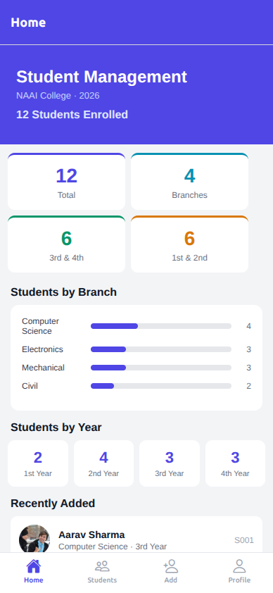
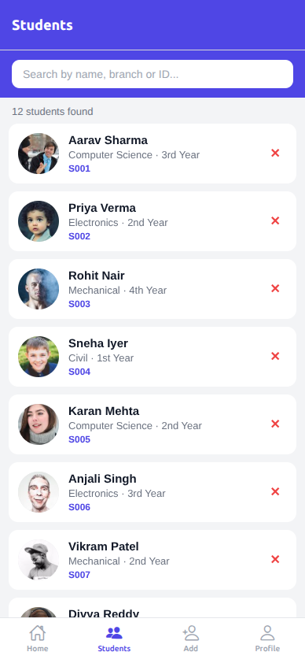
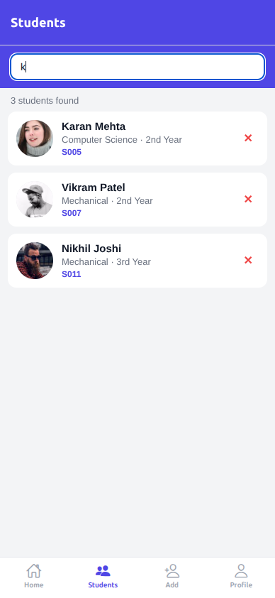
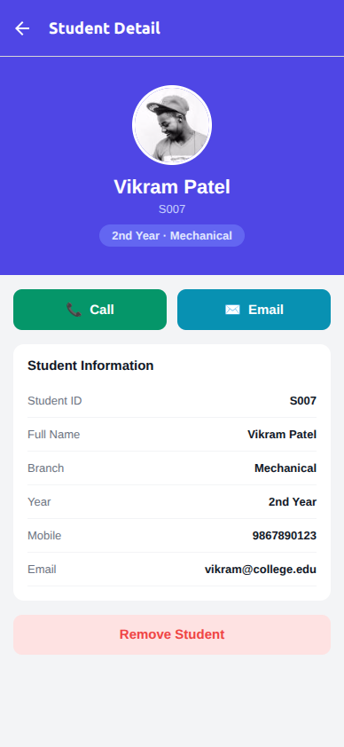
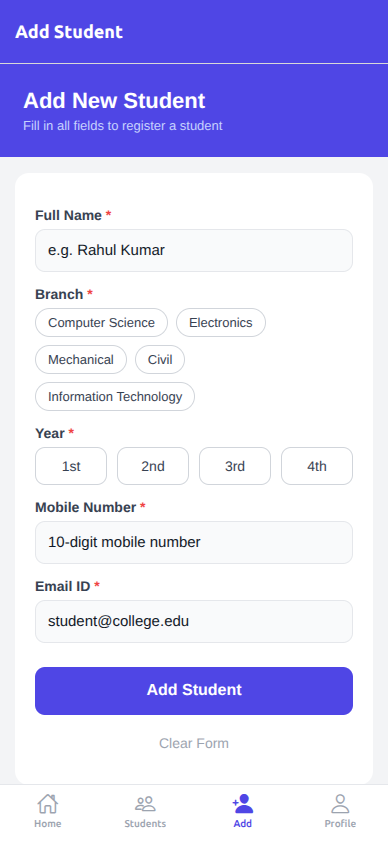
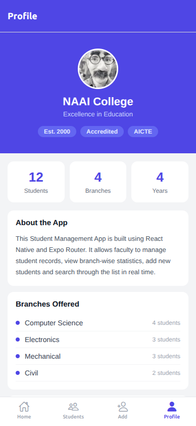

# Student Management App

A React Native mobile application built with Expo Router for managing student records at NAAI College.

## Project Description

This app allows faculty to manage student information through a clean and intuitive interface. It supports adding, viewing, searching, and removing student records with real-time state management using React Context.

## Features

- 📊 **Statistics Dashboard** — branch-wise and year-wise student breakdown with visual bar charts
- 👥 **Student List** — searchable FlatList with card layout showing all students
- ➕ **Add Student** — form with full validation (mobile, email, branch, year)
- 🔍 **Search** — real-time search by name, branch, or student ID
- 🗑️ **Remove Student** — delete from list or detail screen with confirmation alert
- 📋 **Student Detail View** — full profile with call and email action buttons
- 🔄 **Pull-to-Refresh** — on both Home and Student List screens
- 🧭 **Bottom Tab Navigation** — Home, Students, Add, Profile tabs with icons
- 📱 **Responsive UI** — works across Android screen sizes

## Screens

| Screen | Description |
|---|---|
| Home | Dashboard with stats, branch breakdown, year breakdown, recent students |
| Students | Full list with search and delete |
| Add Student | Form with validation to register a new student |
| Profile | College info, branch list, app details |
| Detail | Full student profile with call/email/remove actions |

## Tech Stack

- React Native
- Expo SDK
- Expo Router (file-based navigation)
- TypeScript
- React Context (state management)
- @expo/vector-icons (Ionicons)

## Installation Steps

1. **Clone the repository**
   ```bash
   git clone https://github.com/pankaj1996saini/StudentApp.git
   cd StudentApp
   ```

2. **Install dependencies**
   ```bash
   npm install
   ```

3. **Start the development server**
   ```bash
   npx expo start
   ```

4. **Run on Android**
   - Press `a` in the terminal to open on Android emulator
   - Or scan the QR code with the Expo Go app on your Android device

## Project Structure

```
StudentApp/
├── app/
│   ├── _layout.tsx          # Root layout with StudentProvider
│   ├── detail.tsx           # Student detail screen
│   └── (tabs)/
│       ├── _layout.tsx      # Tab bar configuration
│       ├── index.tsx        # Home / Dashboard
│       ├── students.tsx     # Student list with search
│       ├── add.tsx          # Add student form
│       └── profile.tsx      # Profile / About screen
├── store/
│   └── studentStore.tsx     # React Context store
├── assets/
│   └── logo.png
└── README.md
```

## Screenshots













## Developer

**Pankaj Saini**  
React Native Mobile Application Assignment
